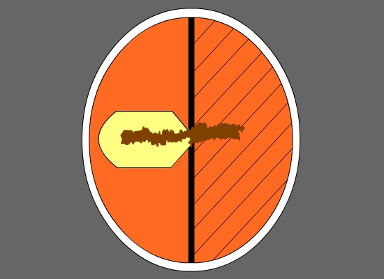
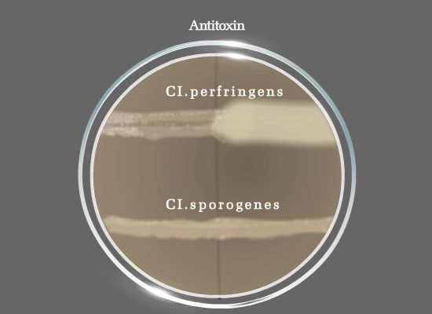

### Principle:
 
Bacterial lecithinases are of special interest because of the possible role of these enzymes in pathogenicity. Lecithinases or phospholipases are enzymes released by bacteria that have the ability to destroy animal tissues. Phospholipid complexes are usually emulsifying agents occurring in tissues, serum and egg yolk. Lecithin is a normal component of the egg yolk. Bacterial lecithinases break down this lecithin to an insoluble diglycerides resulting in an opaque halo, surrounding the colony when grown on the egg yolk agar medium.

In egg yolk agar, the lipoprotein component Lecithovitellin can also be split by lecithinase into phosphorylcholine and an insoluble diglyceride, which results in the formation of a precipitate in the medium. This precipitate occurs as a white halo, surrounding the colony that produces lecithinase enzyme. The opalescence created is due to the release of free fat. Lecithinase activity is used to characterize several gram positive and gram negative bacteria.

Egg Yolk Agar, Modified is a differential and enriched medium used in the isolation and presumptive differentiation of different species based on their lecithinase and lipase production and proteolytic activity. The egg yolk suspension in the medium allows the detection of lecithinase and lipase activity of the microorganism. The degradation of lecithin present in the egg yolk results in  the formation of  opaque precipitate around the colonies.  The Lipase enzyme hydrolyzes the fats within the egg yolk, which results in an iridescent sheen on the colony surface. 

Another common reaction observed is proteolysis of the egg yolk as indicated by a clearing of the medium around the colonies. Enzymatic digests of casein and soybean meal supply amino acids and other complex nitrogenous substances. Yeast extract primarily provides the B-complex vitamins. Hemin improves the growth of anaerobic microorganisms. L-cystine is a reducing agent and an essential amino acid.

&nbsp;

#### Lecithinase Producing Organism:

Bacillus cereus is a pathogen, often encountered in meat and poultry products.  This pathogen is an usually strong positive producer of lecithinase enzyme, strongly hemolytic on sheep blood agar, and is actively motile. Other lecithinase positive or weakly positive cultures may be B. thuringiensis and B.anthracis. B.anthracis however is a non motile organism and produces non hemolytic colonies. Bacillus sphaericus is a negative producer of Lecithinase.                                 

Clostridium perfringens is lecitinase positive while most of the other strains of Clostridium are lecithinase negative (Clostridium difficile, Cl.sporogenes). Nagler’s reaction is used to differentiate perfringens group from other Clostridia which are lecithinase positive (eg: Clostridium baratii, Clostridium absonum, Clostridium bifermentans, Clostridium novyi) by the addition of a specific antitoxin for the neutralization of lecithinase C.

Lecithinase will also separate Pseudomonas putida (negative) from Pseudomonas fluorescens (positive). This test can be a substitute for gelatin hydrolysis.

&nbsp;

#### Identification of Bacillus species using Mannitol Egg Yolk Polymixin agar.

Bacillus cereus, a strong lecithinase positive organism, can be identified using Mannitol-egg yolk-polymyxin (MYP) agar plates. It is an aerobic spore producing organism  that is found commonly  in soil, in many raw and processed foods,on vegetables,  and often a causative agent of food poisoning.  MYP Agar contains beef extract and peptone as sources of carbon, nitrogen, vitamins and minerals. D-Mannitol is the carbohydrate source. Phenol red is the pH indicator. Agar is the solidifying agent. Egg Yolk Enrichment 50% provides lecithin. Antimicrobial P is Polymyxin B which inhibits the growth of most other bacteria. Bacteria that ferment mannitol produce acid products and form colonies that are yellow. Bacteria that produce lecithinase hydrolyze the lecithin and a zone of white precipitate forms around the colonies. B. cereus is typically mannitol-negative, produce pink-red colonies in MYP agar with a zone of precipitate around the colonies, indicating lecithinase-positive activity.

Bacillus subtilis, is also an aerobic spore producing bacterium, and non-pathogenic to humans. This species ferments mannitol, changing the color of the medium into yellow, but lacks the ability to produce enzyme Lecithinase. Instead Bacillus subtilis is known to produce a proteolytic enzyme Subtilisin that has wide range of applications in leather industry.(Fig 1)

Fig 1: Bacillus cereus produce pink colonies with opaque halo zones;Bacillus subtilis produce yellow colonies and uninoculated region remains

&nbsp;

#### Differentiating Clostridium perfringens from other Clostridium species: Naglers reaction
 

If Clostridia species is suspected in a clinical sample, an egg yolk agar plate can be used to check for the production of Lecithinase and Lipase activity of the suspected sample. AnaeroGRO™ Egg Yolk Agar, Modified is an enriched, non-selective, and differential medium, and is also used in the Nagler Test for the presumptive identification of Clostridium perfringens. It is packed in oxygen – free, reduced state in order to prevent the formation of toxic oxidized by-products that will damage the obligate anaerobes and inhibit the growth of more fastidious species.

Ingredients in the media neutralize the growth inhibiting effects of peroxide and other reactive oxygen species that may develop when the medium is exposed to Oxygen after the sterilization and before packaged in Oxygen – free environment. (Reducing agents like L- Cysteine). Naglers test is important for the identification of alpha toxin of Clostridium perfringens, the addition of antitoxin to one half of egg yolk agar prevents visible opacity, due to lecithinase action which is normally observed around colonies. Other species of Clostridium shows Negative Naglers reaction (Fig 2)

For carrying out the Naglers reaction strict anaerobic conditions are maintained. The Clostridial species to be characterized is maintained in Thioglycolate broth, a rich liquid medium that supports the growth of both aerobic and anaerobic bacteria. It contains glucose, cystine, and sodium thioglycollate to reduce its oxidation-reduction (O/R) potential. It also contains the dye resazurine that is an indicator for the presence of oxygen. In the presence of oxygen the dye becomes pink. Since the oxygen tension is always higher near the surface of the medium, the medium will be pink at the top and colorless in the middle and bottom. The medium also contains a small amount of agar that helps to localize the organisms and favors anaerobiosis in the bottom of the tube.

 Fig 2:  Nagler plate